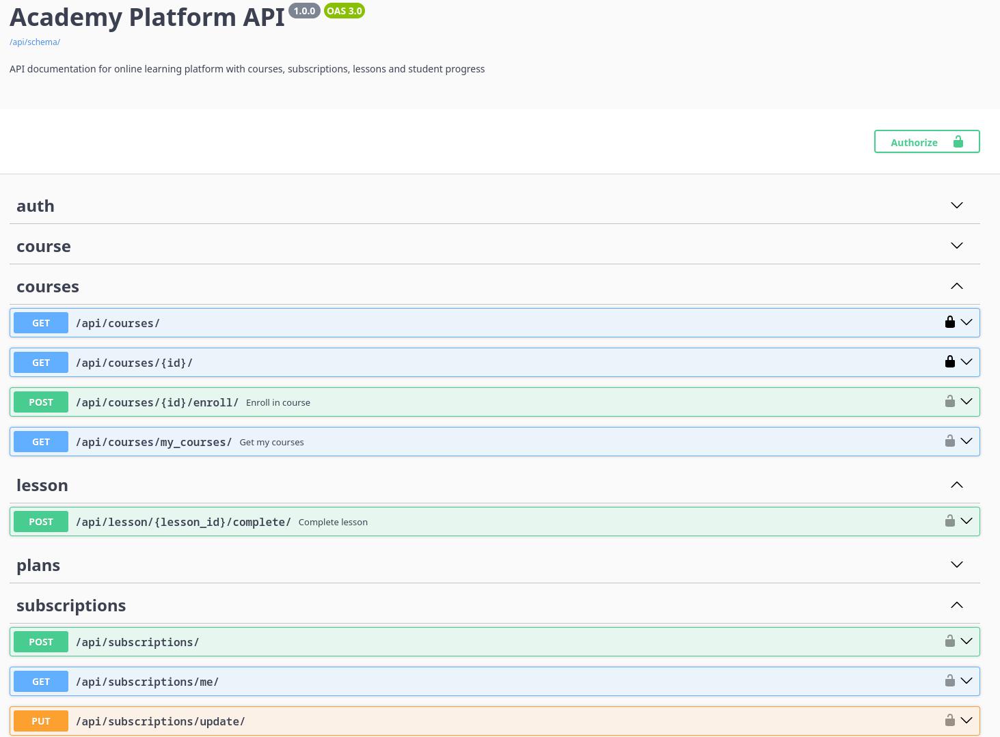

# Code Academy Platform




Code Academy Platform is a subscription-based LMS platform that lets users explore multiple courses through one
subscription instead of buying each course separately.

The project demonstrates backend development skills through REST API, JWT authentication, course enrollment,
subscription-based lesson access control, Celery background tasks, Redis caching, PostgreSQL, Docker, Swagger
documentation, and automated tests.

- **Live demo:** http://3.82.25.210/
- **API docs:** http://3.82.25.210/api/docs/
- **Admin panel:** http://3.82.25.210/admin/

## Why this project?

Many online learning platforms sell each course separately. This makes it harder for users to explore different learning
paths, because every new course requires a separate purchase.

Code Academy Platform solves this problem with a subscription-based LMS model. Users activate one subscription, enroll
in available courses, and get access to lessons only while their subscription is active and they are enrolled in the
selected course.

This approach keeps course access flexible for users and makes access control clear on the backend side.

## Features

- **Subscription-based LMS model:** users access the platform through one subscription instead of buying each course
  separately, which makes it easier to explore different learning paths.
- **Course enrollment:** users enroll in selected courses after activating a subscription, keeping their learning flow
  organized.
- **Protected lesson access:** lessons are available only for authenticated users with an active subscription and course
  enrollment.
- **Student progress tracking:** completed lessons are stored per student, so learning progress can be tracked and
  restored later.
- **JWT authentication:** access/refresh tokens with refresh rotation and blacklist support provide secure API
  authentication.
- **REST API:** course, lesson, subscription, plan and user endpoints are built with Django REST Framework.
- **Redis caching:** frequently requested course and lesson data is cached to reduce repeated database queries and
  improve response time.
- **Celery background tasks:** subscription creation and renewal trigger asynchronous notification tasks without
  blocking API responses.
- **Swagger/OpenAPI documentation:** interactive API docs generated with drf-spectacular make the API easy to explore
  and test.
- **Dockerized setup:** separate development and production Docker configurations make the project easier to run and
  deploy.
- **PostgreSQL database:** relational data model stores users, courses, subscriptions, subscription history and lesson
  progress.
- **Automated tests:** pytest tests cover authentication, courses, lessons, subscriptions, permissions and progress
  tracking.

## Tech Stack

| Layer             | Technology                              |
|-------------------|-----------------------------------------|
| Backend           | Python 3.13, Django 5.2                 |
| API               | Django REST Framework                   |
| Authentication    | Simple JWT                              |
| Database          | PostgreSQL 16                           |
| Cache             | Redis                                   |
| Background Tasks  | Celery, Redis broker                    |
| API Documentation | drf-spectacular, Swagger, ReDoc         |
| Frontend          | Django Templates, HTML, Tailwind CSS    |
| Testing           | pytest, pytest-django                   |
| Infrastructure    | Docker, Docker Compose, Gunicorn, Nginx |

## Business Logic

The platform uses a subscription-based access model.

Users do not buy each course separately. Instead, they activate a subscription and can enroll in available courses.

Lesson access is protected by three rules:

1. The user must be authenticated.
2. The user must have an active subscription.
3. The user must be enrolled in the selected course.

If one of these conditions is not met, the API returns `401 Unauthorized` or `403 Forbidden`.

## API Overview

### Authentication

| Method | Endpoint                | Description                          |
|--------|-------------------------|--------------------------------------|
| POST   | `/api/auth/register/`   | Register a new user                  |
| POST   | `/api/token/`           | Obtain JWT access and refresh tokens |
| POST   | `/api/token/refresh/`   | Refresh access token                 |
| POST   | `/api/token/blacklist/` | Blacklist refresh token              |

### Courses

| Method | Endpoint                    | Description             |
|--------|-----------------------------|-------------------------|
| GET    | `/api/courses/`             | List courses            |
| GET    | `/api/courses/{id}/`        | Retrieve course details |
| POST   | `/api/courses/{id}/enroll/` | Enroll in course        |
| GET    | `/api/courses/my_courses/`  | List enrolled courses   |

### Lessons

| Method | Endpoint                                 | Description              |
|--------|------------------------------------------|--------------------------|
| GET    | `/api/course/{course_id}/`               | Get current lesson       |
| GET    | `/api/course/{course_id}/lesson/{slug}/` | Get lesson by slug       |
| POST   | `/api/lesson/{id}/complete/`             | Mark lesson as completed |

### Subscriptions

| Method | Endpoint                     | Description                   |
|--------|------------------------------|-------------------------------|
| GET    | `/api/plans/`                | List subscription plans       |
| POST   | `/api/subscriptions/`        | Create subscription           |
| GET    | `/api/subscriptions/me/`     | Get current subscription      |
| PUT    | `/api/subscriptions/update/` | Update subscription           |
| PATCH  | `/api/subscriptions/update/` | Partially update subscription |

## Background Tasks & Caching

### Background Tasks

Celery is used for asynchronous subscription-related notifications.

Background tasks are triggered when:

- a user activates a subscription;
- a user extends an existing subscription.

The current implementation writes notification messages to the console. This can be extended with real email, SMS,
Telegram or other notification providers.

### Caching

Redis is used as the cache backend for frequently requested data.

Cached data includes course and lesson-related responses. This helps reduce repeated database queries and improves API
response time for repeated requests.

## Tests

The project includes automated tests for API endpoints, permissions and business logic.

Tested scenarios include:

- user registration;
- JWT authentication;
- course list and course detail;
- course enrollment;
- subscription creation;
- subscription renewal;
- current subscription endpoint;
- lesson access permissions;
- lesson completion;
- progress tracking;
- forbidden access without subscription;
- forbidden access without course enrollment.

Run tests:

```bash
docker compose -f compose.dev.yml exec web pytest
```

## Quickstart

**Clone the repository:**

```bash
git clone https://github.com/igor-chernobai/code-academy-platform.git
cd code-academy-platform
```

**Create environment file:**

```bash
cp .env.example .env.dev
```

**Run development environment:**

```bash
docker compose -f compose.dev.yml up --build
```

**Create superuser:**

```bash
docker compose -f compose.dev.yml exec web python manage.py createsuperuser
```

**Open the application:**

```text
Web app:     http://127.0.0.1:8000/
Admin panel: http://127.0.0.1:8000/admin/
API docs:    http://127.0.0.1:8000/api/docs/
```

## Author

**Igor Chernobai**  
Python Backend Developer

- GitHub: https://github.com/igor-chernobai
- LinkedIn: [https://www.linkedin.com/in/igor-chernobai/](https://www.linkedin.com/in/igor-chernobai/)
- Email: [chernobai.i2112@gmail.com](mailto:chernobai.i2112@gmail.com)
